# Radiobase Raspberry Pi Zero

`home/rudi/Documentos/GitHub/Lambari-RadioBase`

A estação radio base é implementado com o Raspberry Pi Zero, um enlace de rádio com a boia de instrumentação e um enlace de comunicação via internet com o ScadaBR

# 1. Hardware

A estação tem os seguintes componentes

* Raspberry PI
* Painel solar de alimentação com controlador de carga de bateria
* Monitor de tensão, corrente e potência IN219
* Enlace de radio
* Enlace de internet
* Módulo Real time clock RTC com DS3231 
* Carregador da bateria com algoritmo MPPT

O diagrama de blocos da radiobase é apresentado a seguir.

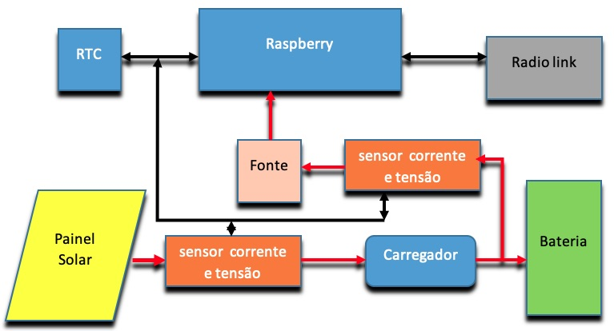

## 1.1. Raspberry PI Zero

Descrição das funcionalidades do Raspberry Pi Zero usadas neste projeto.


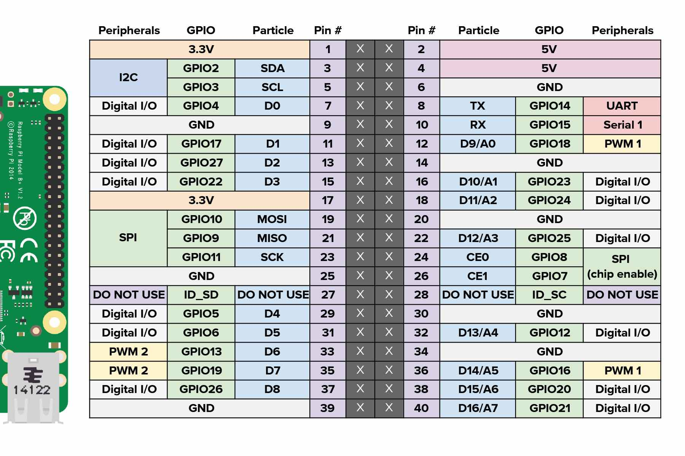


Barramento 

| Funcionalidade | descrição      | pinos do raspberry |
|:--------------:|:--------------:|:------------------:|
| I2C            | INA 219 & RTC  | 3, 5  (SDA,SCL)    |  
| UART           | Módulo RF LoRa | 8, 10 (TX, RX) 7, 16, 18 |
| PWM            | Carregador de bateria | 12 |
| Watchdog       | ? |


## 1.2. Alimentação

Solar, bateria e controlador de carga da bateria

[https://www.tinytronics.nl/shop/en/dc-dc-converters/lt3652-solar-power-battery-charge-module-mppt](https://www.tinytronics.nl/shop/en/dc-dc-converters/lt3652-solar-power-battery-charge-module-mppt)

With this module based on the LT3652 chip, Maximum Power Point Tracking (MPPT) uses a solar panel ( this, for example) to charge a Li-Po/Li-ion battery as efficiently as possible.

Specifications:

* Input voltage (output voltage solar panel): 7-32V DC
* Maximum charging current: 450mA (can be increased, see below)
* Minimum power solar panel: 3.5W
* Maximum output voltage: 4.2V


For more information about the LT3652, see the datasheet under the tab "Downloads and Links".

Pinout :

* VIN: Input voltage; positive (+) connection of the solar panel
* BATT: Positive (+) connection of the battery
* LODA: Positive (+) connection of the load
* GND: Ground/min
* SET: Pin to set the MPPT point, see instructions below
* NTC: Allows a loading time to be set, see the datasheet for more information
* FAULT: Error indicator pin: When an error occurs, this pin is pulled down (to GND)
* CHRG: Charge indicator pin: When the solar panel charges the battery, this pin is pulled down (to GND)
* Instructions:

1. Connect the solar panel you want to use, but no load or battery;
2. Aim the solar panel directly at the sun and measure the voltage between the SET and GND pins;
3. Turn the potentiometer with a screwdriver until the SET pin is between 2.8V and 3.0V;
4. The module is now set as efficient as possible, now connect a Li-Po/Li-ion battery and optionally a load.


Note: This module has no battery protection circuit, it is recommended to use one!

Increase charge current :

The charging current can be increased by soldering an extra resistor at the pins of R_SEN:

* R_SEN = 1 Ohm: Maximum charging current is 550mA
* R_SEN = 0.5 Ohm: Maximum charging current is 650mA
* R_SEN = 0.33 Ohm: Maximum charging current is 750mA
* R_SEN = 0.22 Ohm: Maximum charging current is 800mA

Note: Make sure that the battery can also handle the increased charge current!


## 1.3. Monitoramento de tensão, corrente e potência da alimentação e da bateria

A radiobase conta com o monitoramento da tensão e corrente que vem da rede de alimentação (pode ser da rede de distribuição) e da tensão e corrente da bateria.

O monitoramente é feito pelo módulo INA219 que passa os dados de tensão, corrente, potência por meio de uma interface I2C
[https://www.filipeflop.com/produto/sensor-de-corrente-dc-ina219-i2c/](https://www.filipeflop.com/produto/sensor-de-corrente-dc-ina219-i2c/).

| pino Raspberry | descrição | pino INA 219 |
|:---------:|:---------:|:--------:|
| 1 | 3.3V | 1 |
| 3 | SDA  | 4 |
| 5 | SCL  | 3 |
| 6 | GND  | 2 |

A configuração da interface I2C no Raspberry é feito pelo programa `raspi-config`. 

Uma vez configurado a interface I2C pode se fazer uma varredura no endereços do barramento com o comando `i2cdetect` que faz parte do pacoto i2c-tools que pode ser instalado com `sudo apt-get install python-smbus i2c-tools`.


```
pi@radiobase:~/src/radiobase $ i2cdetect -y 1
     0  1  2  3  4  5  6  7  8  9  a  b  c  d  e  f
00:          -- -- -- -- -- -- -- -- -- -- -- -- -- 
10: -- -- -- -- -- -- -- -- -- -- -- -- -- -- -- -- 
20: -- -- -- -- -- -- -- -- -- -- -- -- -- -- -- -- 
30: -- -- -- -- -- -- -- -- -- -- -- -- -- -- -- -- 
40: 40 -- -- -- -- -- -- -- -- -- -- -- -- -- -- -- 
50: -- -- -- -- -- -- -- -- -- -- -- -- -- -- -- -- 
60: -- -- -- -- -- -- -- -- -- -- -- -- -- -- -- -- 
70: -- -- -- -- -- -- -- --                         
```

Como mostrado, o endereço do INA219 é 0x40.

O python tem uma uma bibliiteca completa para fazer a leitura dos dados do INA219 no link  [https://pypi.org/project/pi-ina219/](https://pypi.org/project/pi-ina219/).

O segundo INA219 teve o endereço modificado para 0x41 por meio de jumper na placa e o procedimento de identificação é igual que o primeiro.


## 1.4. Real Time Clock - RTC 

O Raspberry não tem relógio em tempo real. Cada vez que o Raspberry é inicializada a rotina de boot procure o tempo correto na internet por meio de uma rotina de `systemd-timesyncd` [https://wiki.archlinux.org/index.php/systemd-timesyncd](https://wiki.archlinux.org/index.php/systemd-timesyncd).

A desvantagem dessa solução é que se não tiver uma rede de internet todas as ações relacionados ao relógio interno do Raspberry ficam defasados. Isso é bastante crítica numa operação de monitoramento de dados em tempo real. 

Para resolver isso colocamos um RTC [https://www.huinfinito.com.br/modulos/1466-modulo-rtc-com-ds3231-e-eeprom-24c32.html](https://www.huinfinito.com.br/modulos/1466-modulo-rtc-com-ds3231-e-eeprom-24c32.html) baseado no DS3231 que tem uma interface I2C.

O módulo foi colocado no mesmo barramento de comunicação I2C onde está o acoplado o módulo INA912. 

O procedimento apresentado no link 
[https://www.arduinoecia.com.br/como-usar-rtc-ds3231-raspberry-pi](https://www.arduinoecia.com.br/como-usar-rtc-ds3231-raspberry-pi) foi usado para programar o Raspberry a reconhecer o RTC e carregar o módulo no kernel do linux.

O mesmo procedimento de identificar o endereço do módulo no I2C que foi empregado na instalação do módulo de IN912 serve para o RTC. O comando `i2cdetect` identificou o endereço do RTC que é 0x68.

```
pi@radiobase:~/src/radiobase $ i2cdetect -y 1
     0  1  2  3  4  5  6  7  8  9  a  b  c  d  e  f
00:          -- -- -- -- -- -- -- -- -- -- -- -- -- 
10: -- -- -- -- -- -- -- -- -- -- -- -- -- -- -- -- 
20: -- -- -- -- -- -- -- -- -- -- -- -- -- -- -- -- 
30: -- -- -- -- -- -- -- -- -- -- -- -- -- -- -- -- 
40: 40 -- -- -- -- -- -- -- -- -- -- -- -- -- -- -- 
50: -- -- -- -- -- -- -- 57 -- -- -- -- -- -- -- -- 
60: -- -- -- -- -- -- -- -- UU -- -- -- -- -- -- -- 
70: -- -- -- -- -- -- -- --                         
pi@radiobase:~/src/radiobase $ 
```

Para incluir o RTC no kernel é preciso incluir as linhas `i2c-bcm2835` e `rtc-sd1307` no arquivo `/etc/modules` 

```
pi@radiobase:~/src/radiobase $ cat /etc/modules
# /etc/modules: kernel modules to load at boot time.
#
# This file contains the names of kernel modules that should be loaded
# at boot time, one per line. Lines beginning with "#" are ignored.

i2c-dev
i2c-bcm2835
rtc-sd1307

```

Outro passo é incluir no arquivo  `/etc/rc.local` as duas linhas novas no final do arquivo `echo ds1307 0x68 > /sys/class/i2c-adapter/i2c-1/new_device` e `sudo hwclock -s` que apontam para a novo dispositivo I2C e sincroniza o relogio do Raspberry com o RTC na hora do boot. 


```
pi@radiobase:~/src/radiobase $ cat /etc/rc.local 
#!/bin/sh -e
#
# rc.local
#
# This script is executed at the end of each multiuser runlevel.
# Make sure that the script will "exit 0" on success or any other
# value on error.
#
# In order to enable or disable this script just change the execution
# bits.
#
# By default this script does nothing.

# Print the IP address
_IP=$(hostname -I) || true
if [ "$_IP" ]; then
  printf "My IP address is %s\n" "$_IP"
fi
echo ds1307 0x68 > /sys/class/i2c-adapter/i2c-1/new_device
sudo hwclock -s

exit 0
```

Feito isso, basta dar um reboot no Raspberry para que as alterações ficam registrados.

Pode-se verificar o correto carregamento do módulo RTC com o comando `dmesg`


```
pi@radiobase:~/src/radiobase $ dmesg | grep ds1
[   35.026041] i2c i2c-1: new_device: Instantiated device ds1307 at 0x68
[   35.136021] rtc-ds1307 1-0068: registered as rtc0
```

Entretanto, o linux ainda continuava buscando  automaticamente pelo horário da internet durante o boot, e isso bagunçava o meu timestamp nos arquivos.
Eu descobri isso analisando o log file do cron no `/var/log/crontab.log` que mostrava a tentativa de sincronização com `systemd-timesyncd`. 

O comando para desabilitar a busca automatica do horário na internet é: `sudo timedatectl set-ntp false`

## 1.5. Acessando o Raspberry pelo serial UART 

Uma maneira simples de acessar o Raspberry sem ter que usar monitor teclado ou rede é pela porta UART1 do Beagle. 
Essa porta já vem habilitado para você entrar por meio de um programa emulador de terminal. Os pinos do Raspberry que permitem este acesso são dados na tabela a seguir.

| Raspberry | pino | UART|
|:----------|------|-----|
| gnd       | 14 | GND |	
| tx uart1  |  8 | rx |	
| rx uart1  | 10 | tx |	

O nível de tensão do UART é de 3.3 volts, e pode se acessar com um conversor USB- Serial TTL.

O UART já vem configurado para 115 kbs e permitindo login diretamente com um programa emulador de terminal tem que estar configurado com a porta serial em 115kbps, 8N1.

Colocamos na estação um conector P3 com chave comutadora, que permite que possamos ligar a porta serial ao conversor USB-Serial-TTL. 
Ao inserir o conector P3 o circuito é desconectado da ligação com a placa de radio enlace e direcionado para o conversor USB-Serial-TTL.

 

## 1.6. Enlace de rádio E32-TTL-100

O módulo RF LoRa 433Mhz E32-TTL-100 [(datasheet)](https://img.filipeflop.com/files/download/E32_User+Manual_EN_v1.00.pdf) tem os seguintes pinos que estão ligados ao barramento do Raspberry 


| pino | nome  | sentido | descrição | pino Raspberry |
|:----:|:-----:|:-------:|:----------|:--------------:|
| 1 | M0  | Entrada  | Configurar modo de operação | 18 - D11 (GPIO.5)|
| 2 | M1  | Entrada  | Configurar modo de operação | 16 - D10 (GPIO.4)|
| 3 | RXD | Entrada  | Receptor conectado ao TX Micro | 08 - TX | 
| 4 | TXD | Saida    | Transmissor conectado ao RX micro | 10 - RX |
| 5 | AUX | Saida    | Indicação estado do módulo | 07 - D0 (GPIO.7)|
| 6 | VCC | Alimentação | 3,3 ou % Vdc | 1 - 3.3v |
| 7 | GND | Alimentação | Comum ground | 6 - GND  |

Os pinos M0 e M1 devem ser colocados em baixo para operação normal.

Transmiting current 110 mA.
Recieving current 14 mA.
Turn-off currente 5 uA. (micro)
Transmitting power 20 dBm.


AUX Pin can be used as indication for wireless send & receive buffer and self-check. It can indicate whether there are data that are yet to send via wireless way, or whether all wireless data has been sent through UART, or whether the module is still in the process of self-check initialization.

| Mode       | M1 | M0 | descrição | 
|:----------:|:--:|:--:|:----------|
| 0-Normal   | 0  | 0  | Uart and wireless channel are open - transparant tranmission is on |  
| 1-Wake up  | 1  | 0  | UART and wireless channel are open. The difference between normal mode and wake-up mode is it will add preamble code automatically before data packet transmission so that it can awaken the receiver works in mode 2 |
| 2-P.Saving | 0  | 1  | UART is disabled. Wireless module works at WOR mode (wake on radio). It will open the UART and transmit data after receiving the wireless data |
| 3-Sleep    | 1  | 1  | Parameter setting |

Para configurar e habilitar a porta serial do Raspberry é necessário executar o `raspi-config`

Feito isso, vamos usar um programa em python para operar a comunicação com enlace de radio.


## 1.7 Carregador Solar MPPT da bateria

Desenvolvimento de um carregador de bateria com capacidade de Maximum Power Point Tracking - MPPT para a estação radio base. A proposta é usar a capacidade computacional do Raspberry para implementar o MPPT, enquanto se usa um circuito adaptado para o circuito de potência.
	O elemento central numa estratégia de MPPT é o monitoramento da potência (tensão x corrente) consumido pela bateria / carga e usar essa informação para modular a fonte de tensão/corrente que alimenta a bateria. O diagrama de blocos do carregador MPPT segue abaixo.

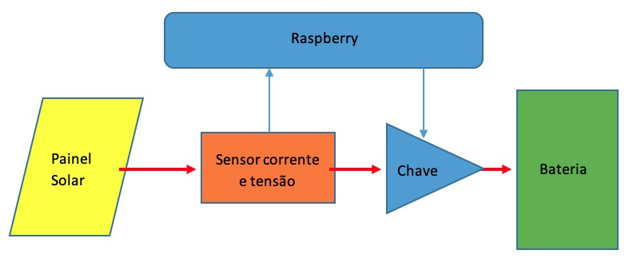

Vamos usar o pino 12 ou GPIO.1 ou PWM1 do Raspberry para controlar a tensão aplicada na bateria. 

Para configurar o PWM podemos usar o utilitário `gpio` para configurar e comandar os pinos. Este utilitário está no link [http://wiringpi.com/](http://wiringpi.com/)


O hardware do carregador foi implementado com um optoisolador 4n25, um BC547 e um IRF9530N e um circuito retificador simples, conforme mostrada no seguinte circuito.

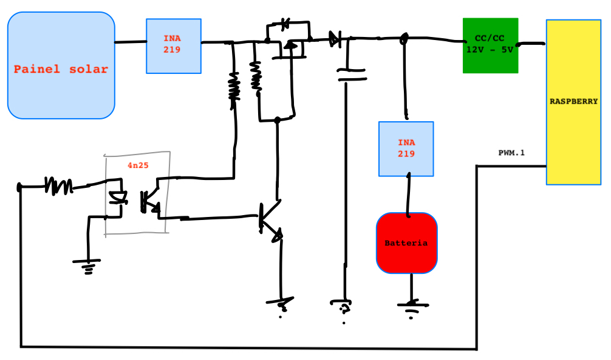  

Foram feitos alguns testes para ver o comportamento do circuito e a figura a seguir mostra o ensaio do carregador com a bateria descarregada e o PWM com ciclo de 50%, uma frequencia de chaveamento de aproximandamente 20 Hz. 
Escolheu se essa frequencia por causa da resposta de chaveamento do circuito optoisolador e mosfet. Quando ajustado em frequencias maiores o mosfet / 4n25 não consegue descarregar.   

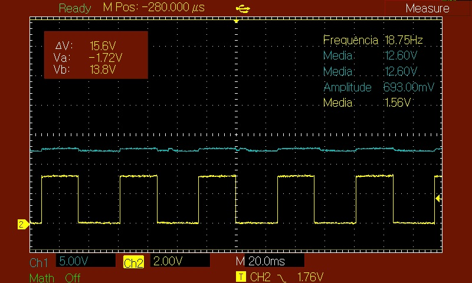

A tensão, corrente e potência foi medido com os INA219 fazendo a captura de dados a uma taxa de amostragem de 2 Hz. 

Pode-se perceber que as caracteristicas elétricas da bateria sendo carregado impõe um comportamento dinâmica interessante. A corrente aplicada injetada na bateria tem um comportamento pulsante com uma frequência e mesmo o filtro de 2200 uF não foi suficiente. 
A medição feito pelo INA219 não captou todo o comportamento da corrente de carga, pois a frequencia de chaveamento era 10 vezes maior que a frequencia de leitura do INA219.

Na curva de corrente pode ver claramente, que no ciclo ligado do PWM a bateria é carregada com um pico de 450mA e no ciclo desligado a bateria fornece em torno de 80 mA para o Raspberry.

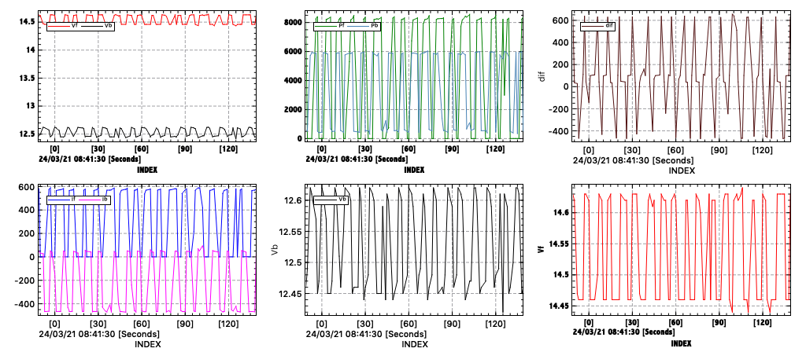  

Fica a seguinte dúvida se este comportamento chaveado do PWM e o fato de não ter um valor média depois do retificador pode comprometer o algoritmo de MPPT. Pois vai ter que calcular o valor médio (RMS) dos INA219 para poder fazer o calculo do ponto de potência máxima.

Uma alternativa será implementar um regulador série e usar o PWM para gerar um sinal analógico (filtrado) que comandará o circuito analógico de potência.  

A figura a seguir mostra as curvas de tensão, corrente e potência medidos com o INA219 com um (*duty cycle*) do PWM de 0 a 99%.

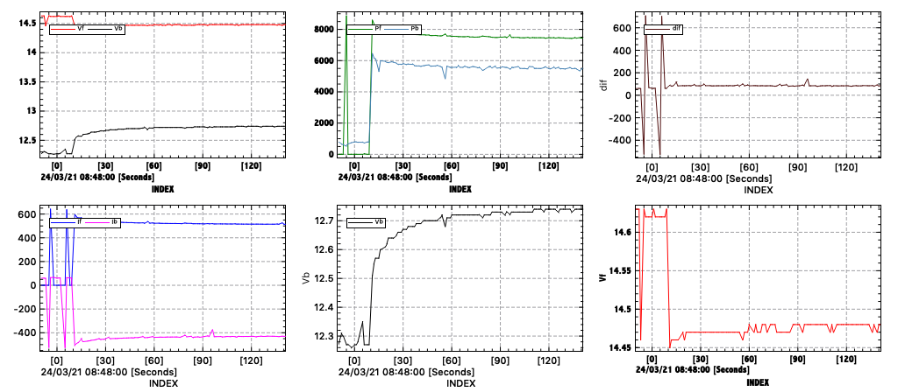

### Nova versão da fonte MPPT

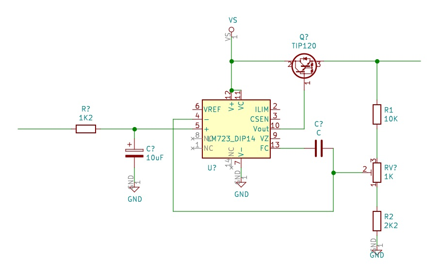

Ensaio com lm723 e tip3055. Observou se uma excessiva dissipação no transistor de potência.


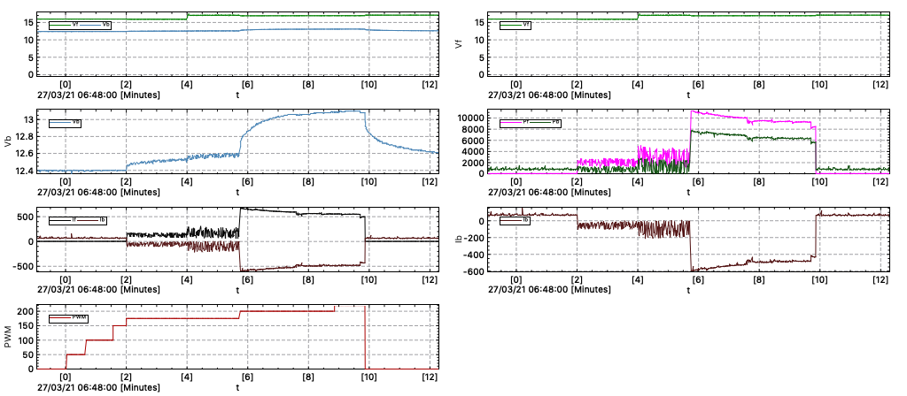

Ensaio com lm723 e tip3055. Variando também a tensão de entrada. Também não gostei da excessiva dissipação no transistor de potência.

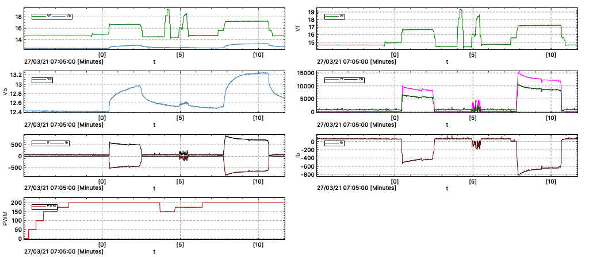

# 2. Software 

O software que roda Raspberry Pi pode ser organizado em quatro níveis. O primeiro é a inicialização das rotinas gerais do sistema que não dependem do hardware. As rotinas de inicialização que dependem do hardware já foram apresentadas na descrição de cada hardware (RTC, INA219).
 
Essas rotinas são chamadas pelo cron e são registrados no `crontab`. Essas rotinas vão fornecer as informações sobre o funcionamento do Raspberry, se houve alguma falha de energia e quando houve essa falha.

Num segundo nível são as rotinas, que também podem ser chamados pelo cron, que cuidam das operações de comunicação com o Scada, fazem a comunicação com a boia de sinalização, e também fazem algum tratamento de dados iniciais. 
Essas rotinas são programados em python 3, pois este conta com uma vasta biblioteca de funções.

Por fim o terceiro nível é a programação de acesso a algumas funcionalidades específicos que precisam de tempo de execução bem definidos ou acesso a hardware específico. Essas rotinas são implementados em linguagem C. 

* Inicialização com crontab - script linux bash
* Programas em python
* Programas em Linguagem C

A filosofia por tras do projeto é aproveitar ao máximo as funcionalidades já disponível no linux, procurando usar funções consolidadas para permitir assim a máxima portabilidade.

Parte-se do princípio que todo que a gente precisa no sistema já deve ter sido inventada ou implementado no linux, já deve ter uma biblioteca em python ou em linguagem C.

O desafio consiste em achar as funcionalidades ou bibliotecas apropriadas para as nossas necessidades e adapta-los.

No outro lado, para a interface com o usuário vamos rodar um supervisório baseado no ScadaBR, procurando aproveitar ao máximo as funcionalidades deste supervisório.

## 2.1. Inicialização pelo cron

Algumas questões do raspberry PI Zero e a inicialização do sistema pelo crontab. 

Primeiro tem que habilitar o log do cron para poder rastrear alguns issues editando `/etc/rsyslog.conf`. Outros issues:

- A sequencia de execução no crontab não obedece a sequencia dos arquivos listados no crontab -e
- Há um descompasso entre a atualização do relógio em tempo real RTC  com o `systemd-timesyncd` que busca o horário na internet
- Isso implica no registro do horário certo do boot e o `hartbeat` 
- Ainda há uma falha na chamada da rotina de atualização dos dados no servidor remoto, que deve ser devido ao erro de registro de horário.
- A rotina de cópia do Raspberry para o servidor ScadaBR com `scp` via `ssh` demora em torno 10 segundos (incluindo o sleep de 5 segundos) para mandar os dados.


| programa | entrada | arquivo de saida | execução |
|:--------:|:-------:|:----------------:|:--------:|
| inicia.sh | crontab  | `lastbeat_dummy.reg` `reboot_dummy.reg` `tensao.log` `corrente.log` `potencia.log`| somente durante o boot |
| hartbeat.sh | crontab | `hartbeat_dummy.log` | a cada minuto

Com essa informação é possível verificar se o Raspberry teve alguma falta de energia ou re-inicialização, pois registra o horário do boot e a ultima atualização do hartbeat. 


```
pi@radiobase:~/src/radiobase $ cat hartbeat.sh 
#!/bin/bash
date '+%Y-%m-%d %H:%M:%S  1' > /home/pi/src/radiobase/hartbeat_dummy.log
# registra o tempo a cada minuto no log
```

O script `inicia.sh` registra  horário do boot e depois de ter mandado essa informação para o Scada, manda a cada 5 segundos os valores de tensão, corrente e potência do que estão gaurdados nos seus respecitivos arquivos `*.log` para o servidor 

```
#!/bin/bash
#
# A primeira parte do inicia.sh trata os dados do lastbeat e reboot 
# para guardar essa informacao no servidos scada
# 
cp /home/pi/src/radiobase/hartbeat_dummy.log /home/pi/src/radiobase/lastbeat_dummy.reg  # registra ultimo beat e reboot
truncate -s-2 /home/pi/src/radiobase/lastbeat_dummy.reg
echo '0' >> /home/pi/src/radiobase/lastbeat_dummy.reg         # ajuste o valor do lastbeat em 0
sleep 20                                                      # garante tempo para completar o boot
uptime -s  > /home/pi/src/radiobase/reboot_dummy.reg
truncate -s-1 /home/pi/src/radiobase/reboot_dummy.reg
echo ' 0' >> /home/pi/src/radiobase/reboot_dummy.reg          # ajuste o valor de reboot em 0 e manda para o servidor scada
sshpass -p 'lea' scp -P 2221 /home/pi/src/radiobase/*.reg lambari@164.41.123.29:/home/lambari/radiobase/fonte/
sleep 5
truncate -s-2 /home/pi/src/radiobase/lastbeat_dummy.reg      #  avise que o lastbeat e reboot voltaram a 1 
echo '1' >> /home/pi/src/radiobase/lastbeat_dummy.reg
truncate -s-2 /home/pi/src/radiobase/reboot_dummy.reg
echo ' 1' >> /home/pi/src/radiobase/reboot_dummy.reg
sshpass -p 'lea' scp -P 2221 /home/pi/src/radiobase/*.reg lambari@164.41.123.29:/home/lambari/radiobase/fonte/
sleep 10
#
#  Esaa parte eh responsavel para mandar os dados lidos pelo python mon_radiobase.py para o servidos scada 
#  quando o scp nao encontra a rede, ele da um erro de time out depois de 2 minutos
#  isso faz com que se perde muitos dados
#   
for (( ; ; ))
do
   # echo "infinite loops [ hit CTRL+C to stop]"
   python3 /home/pi/src/radiobase/mon_radiobase.py
   sshpass -p 'lea' scp -P 2221 /home/pi/src/radiobase/*.log lambari@164.41.123.29:/home/lambari/radiobase/fonte/
   sleep 5
done
#
```

O código fonte desses scripts bash linux que estão sendo chamados pelo cron estão na pasta `/home/pi/src/radiobase/`


Uma cópia do crontab é mostrada na listagem a seguir.

```
pi@radiobase:~/src/radiobase $ crontab -l 
# Edit this file to introduce tasks to be run by cron.
# 
# Each task to run has to be defined through a single line
# indicating with different fields when the task will be run
# and what command to run for the task
# 
# 
# m h  dom mon dow   command
@reboot /home/pi/src/radiobase/inicia.sh
*/1 * * * * /home/pi/src/radiobase/hartbeat.sh
# linha para validar crontab
```


## 2.2. Programas em python leitura INA219

Programa em python que le o tensão, corrente e potência do INA219 e grava a informação em disco.

```
pi@radiobase:~/src/radiobase $ cat mon_radiobase.py 
# Inicio em 15/11/2020 para projeto Lambari @ Rudi
# Programa em python que le o sensor de tensao e corrente INA219
# e grava essa informacao em arquivo de texto
#
from ina219 import INA219
import time
from datetime import datetime

ina = INA219(0.1)
ina.configure()
V=ina.voltage()
A=ina.current()
P=ina.power()

t=str(datetime.now())
agora=t[:19]

f = open("/home/pi/src/radiobase/tensao.log","w")
f.write(str(agora) + " %.3f\n" % V)
f.close()

f = open("/home/pi/src/radiobase/corrente.log","w")
f.write(str(agora) + " %.3f\n" % A)
f.close()

f = open("/home/pi/src/radiobase/potencia.log","w")
f.write(str(agora) + " %.3f\n" % P)
f.close()
```
Veja que o programa apaga e grava o arquivo log apois cada leitura dos sensores. 

 

## 2.3. Programas em python leitura INA219 e checa comunicação de SCP

Caso ha uma falha na rede entre a radiobase e o servidor scada os dados medidos pelo programa `mon_radiobase` serão perdidos, pois o programa de medição de dados regrava apois de cada leitura de sensor os dados no arquivo log, independente do envio ou não pelo SCP.


Quando fizemos a primeira versão do program `mon_radiobase.py` ainda não tinhamos muita experiência em Python e por isso colocamos toda a comunicação numa rotina SCP do sistema operacional. 

Entretanto, a implementação da controle de comunicação quando o servidor fica fora do ar pode ser mais facilmente implemtado em python. 

Assim o cron somente carrega o programa em python e não manda o loop do SCP. 

O novo programa `comunica_radiobase.py` corrige isso e vai verificar se a copia via SCP foi bem sucedido. Caso houver alguma falha na comunicação o programa grava uma copia dos arquivos no diretório `reserv`

Depois será necessário fazer o upload dos dados faltando de forma manual no sistema. 

```
# Aqui vai comecar o loop 
while True:
     V=ina.voltage()
     A=ina.current()
     P=ina.power()
     Vbat=ina2.voltage()
     Abat=ina2.current()
     Pbat=ina2.power()
     t=str(datetime.now())
     agora=t[:19]
     f = open("/home/pi/src/radiobase/tensao.log",status)
     f.write(str(agora) + " %.3f\n" % V)
     f.close()
     f = open("/home/pi/src/radiobase/corrente.log",status)
     f.write(str(agora) + " %.3f\n" % A)
     f.close()
     f = open("/home/pi/src/radiobase/potencia.log",status)
     f.write(str(agora) + " %.3f\n" % P)
     f.close()
     f = open("/home/pi/src/radiobase/bat_tensao.log",status)
     f.write(str(agora) + " %.3f\n" % Vbat)
     f.close()
     f = open("/home/pi/src/radiobase/bat_corrente.log",status)
     f.write(str(agora) + " %.3f\n" % Abat)
     f.close()
     f = open("/home/pi/src/radiobase/bat_potencia.log",status)
     f.write(str(agora) + " %.3f\n" % Pbat)
     f.close()

     b = os.system("sshpass -p 'lea' scp -P 2221 /home/pi/src/radiobase/*.log lambari@164.41.123.29:/home/lambari/radiobase/fonte/")
     if b!=0 : 
          os.system("cat /home/pi/src/radiobase/tensao.log >>       /home/pi/src/radiobase/reserv/res_tensao.log")
          os.system("cat /home/pi/src/radiobase/corrente.log >>     /home/pi/src/radiobase/reserv/res_corrente.log") 
          os.system("cat /home/pi/src/radiobase/potencia.log >>     /home/pi/src/radiobase/reserv/res_potencia.log") 
          os.system("cat /home/pi/src/radiobase/bat_tensao.log >>   /home/pi/src/radiobase/reserv/res_bat_tensao.log") 
          os.system("cat /home/pi/src/radiobase/bat_corrente.log >> /home/pi/src/radiobase/reserv/res_bat_corrente.log") 
          os.system("cat /home/pi/src/radiobase/bat_potencia.log >> /home/pi/src/radiobase/reserv/res_bat_potencia.log") 
     time.sleep(5)     

except: 
print("fim do loop")     

```


## 2.4. Nova versão do programa de comunicação

Para resolver os problemas de segurança e instabilidade com o SCP mudamos para umo novo protocolo de comunicação entre a Radiobase e o ScadaBR.

Escolheu-se usar o protocolo HTTP.
Segue a primeira versão do programa funcional. 

```
$ cat solarloggerhttp.py 
# Rotina de ensaio do algoritmo MPPT que além de pegar os dados do medidores INA219
# Também pega os dados do PWM
# Arquivo de saida no formato para importar no KST2 
# 2021/03/25 O primeiro ensaio queimou o transistor, e não mostrou o valor PWM
# 2021/03/27 Retirando o MPPT e colocando conversor buck boost
# 2021/04/09 Implementando HTTP GET

import os
from ina219 import INA219
import time
from datetime import datetime
import sys
import requests

dt=60
tempo=str(datetime.now())
agora=tempo[:19]

print("Programa para gravar os dados do INA219 @Rudi 2021  ",agora )
print(sys.argv[0],"  arquivo.log ")
print("Tempo de amostragem  em segudos ",dt)
print("Para terminar o programa preciona Command C\n")

#print(sys.argv)
if (len(sys.argv))==2 :
	print ("Arquivo de saida  = ", sys.argv[1])
	logfile=True
	if os.path.isfile(sys.argv[1]) :
         print ("..... Adicionando novos registros ao arquivo", sys.argv[1])  
	else :
         f=open(sys.argv[1],"a") 
         print(".......Criando novo arquivo ", sys.argv[1])
         f.write(agora)
         f.write("  t,    Vf,      If,    Pf,    Vb,      Ib,    Pb    ")
         f.write("\n")
         f.close()
else :
    logfile=False 
    print ("    Falta especificar arquivo de saida $python3", sys.argv[0]," arquivo.log>")    
    
# dt=10
ina1 = INA219(0.1, address=0x40)
ina2 = INA219(0.1, address=0x41)
ina1.configure()
ina2.configure()

print ("    t,    Vf,      If,    Pf,    Vb,      Ib,    Pb")
t=0;
try:
    while True:
        Vb=ina1.voltage()
        Ib=ina1.current()
        Pb=ina1.power()
        if (Ib<0) : 
              Pb =  - Pb
        Vf=ina2.voltage()
        If=ina2.current()
        Pf=ina2.power()
     
        s=("http://164.41.123.29:8080/ScadaBR/httpds?bat_tensao=%5.2f" % Vb) 
        resposta=requests.get(s)
        resposta.status_code
        s=("http://164.41.123.29:8080/ScadaBR/httpds?bat_corrente=%7.2f" % Ib) 
        resposta=requests.get(s)
        resposta.status_code
        s=("http://164.41.123.29:8080/ScadaBR/httpds?bat_potencia=%6.0f" % Pb) 
        resposta=requests.get(s)
        resposta.status_code
        s=("http://164.41.123.29:8080/ScadaBR/httpds?sol_tensao=%5.2f" % Vf) 
        resposta=requests.get(s)
        resposta.status_code
        s=("http://164.41.123.29:8080/ScadaBR/httpds?sol_corrente=%7.2f" % If) 
        resposta=requests.get(s)
        resposta.status_code
        s=("http://164.41.123.29:8080/ScadaBR/httpds?sol_potencia=%6.0f" % Pf) 
        resposta=requests.get(s)
        resposta.status_code
        s= ("%5.1f" % t + "," + " %5.2f" % Vf + "," + " %7.2f" % If + ","+" %6.0f" % Pf + "," + " %5.2f" % Vb + "," + " %7.2f" % Ib + "," + " %6.0f" % Pb)
        print(s)
        if (logfile == True) :
               with open(sys.argv[1],"a") as f:                  
                       f.write(s)
                       f.write("\n")     
               f.close()
        time.sleep(dt)
        t=t+dt
#        try: PWM=input()
#        except: a=1
#        else: os.system("gpio pwm 1 " + PWM)
except KeyboardInterrupt:
     print("#ˆC")
print("#Fim")
     
```

Agora falta integrar este programa no `CRONTAB` e também ver as rotinas para registar o horário de boot e `hartbeat`. 


## 2.5. Programa MPPT 

As bibliotecas de acesso ao GPIO aparentemente em Python aparentemente não conseguem configurar os pinos para usar o PWM hardware e implementam todas as funções em software. 

Por isso vamos usar o acesso ao sistema diretamente com o utilitário `gpio` que é mais robusto e já foi testado em outras aplicações [https://github.com/rudivels/RaspberryPi_Adc](https://github.com/rudivels/RaspberryPi_Adc)

```
import os
os.system("gpio mode 1 pwm") # configura GPIO.1 ou BCM-18 como pwm ou função alternativa alt 5
os.system("gpio pwm-ms")     # configura o pwm para mark-space
os.system("gpio pwmc 4000")  # 18hz
os.system("gpio pwmr 256")   # conversor 8 bits
os.system("gpio pwm 1 0")    # escreve 0 no pwm 
a=10  # valor do pwm
os.system("gpio pwm 1 " + str(a))
```

O programa para fazer o ensaio do circuito de potênica, medindo as correntes, tensões e potências e mostrada seguir. Este programa grava os dados medidos a uma frequencia de 2 Hz em arquivo que depois é visualizado por meio do programa de visualização em tempo real KST2
[http://kst-plot.kde.org/](http://kst-plot.kde.org/)


```
import os
from ina219 import INA219
import time
from datetime import datetime
import sys

#os.system("gpio mode 1 pwm") # configura GPIO.1 ou BCM-18 como pwm ou função alternativa alt 5
#os.system("gpio pwm-ms")     # configura o pwm para mark-space
#os.system("gpio pwmc 4000")   # 150hz
#os.system("gpio pwmr 256")   # conversor 8 bits
#os.system("gpio pwm 1 0")    # escreve 0 no pwm 
#a=250  # valor do pwm
#os.system("gpio pwm 1 " + str(a))

print("Programa para gravar os dados do MPPT @Rudi 2021")
print("para terminar o programa preciona Command C")
if (len(sys.argv))==2 :
	print ("Arquivo de saida  = ", sys.argv[1])
	logfile=True
	if os.path.isfile(sys.argv[1]) :
         print ("..... Adicionando novos registros ao arquivo")  
	else :
         f=open(sys.argv[1],"a") 
         f.write("  t,    Vf,      If,    Pf,    Vb,      Ib,    Pb,  dif")
         #f.write("horario;Referencia;Temperatura;Massa")
         f.write("\n")
         f.close()        	           
else :
    logfile=False 
    print ("    Falta especificar arquivo de saida <python3 mp1.py arquivo.log>")    

ina1 = INA219(0.1, address=0x40)
ina2 = INA219(0.1, address=0x41)
ina1.configure()
ina2.configure()

print ("  t,    Vf,      If,    Pf,    Vb,      Ib,    Pb,  dif")
t=0;
try:
    while True:
        Vb=ina1.voltage()
        Ib=ina1.current()
        Pb=ina1.power()
        Vf=ina2.voltage()
        If=ina2.current()
        Pf=ina2.power()
        s= ("%3d" % t + "," + " %.2f" % Vf + "," + " %7.2f" % If + ","+" %5.0f" % Pf + "," + " %5.2f" % Vb + "," + " %7.2f" % Ib + "," + " %5.0f" % Pb + "," + " %.2f" % (If+Ib))
        print(s)
        if (logfile == True) :
               with open(sys.argv[1],"a") as f:                  
                       #f = open(sys.argv[1],"a")
                       f.write(s)
                       f.write("\n")     
               f.close()                     
        time.sleep(0.5)
        t=t+1
except KeyboardInterrupt:
     print("#ˆC")
print("#Fim")
     
```

Nos ensaios percebeu-se uma instabilidade da leitura do INA219 que faz com que em alguns momentos a corrente apresentado pelo INA219 é o dobro da corrente real. 

Quando se reseta o programa em python o sistema volta a normalidade. Não se sabe que isso é devido a uma instabilidade do Python ou interferência no sistema operacional no barramento I2C. 

**Achei o erro. O inicia.sh chamada pelo CRON estava funcionando e assim ele interfere na leitura do rotina**


### Algoritmo MPPT
Há diversas algoritmos de MPPT. O mais simples é o perturba o observa que tem o seguinte diagrama de estados.
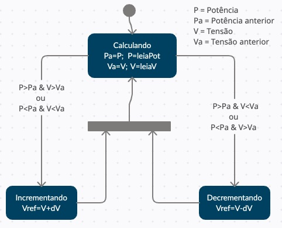 


```
deltaV = 1
estado = 0
while True:
     if estado==0:  # Calculando    
          Pa=P
          Va=V 
          P=ina.power()
          V=ina.voltage()
          if (((P>Pa) and (V>Va)) or ((P<Pa) and (V<Va))): 
               Estado=1
          if (((P>Pa) and (V<Va)) or ((P<Pa) and (V>Va))): 
               Estado=2               
     if estado==1:  # Incrementando
          os.system("gpio pwm 1 " + str(round(V+deltaV)) 
          Estado=0
     if estado==2:  # Decrementando 
          os.system("gpio pwm 1 " + str(round(V-deltaV)) 
          Estado=0         
```

Falta ainda decidir como implementar as duas rotinas SCP e MPPT de forma concorrente.


## 2.5. Programa Python Radio Enlace

Primeira versão do programa em Python para ler o dados da serial.
Com o `raspi-config` é necessária desabilitar o login pela porta `/dev/ttyS0` para poder liberar a porta para um programa de aplicação.

Essa maneira de desabilitar o login não é muito prático, pois se perde a oportunidade de monitorar o boot e tirar alguns problemas pelo login.

O correto seria de uma vez completado o boot, e o sistema estiver todo ok, então o programa de comunicação tira o login da porta ttyS0. 
Ou seja. Sempre durante o boot tem a possibilidade de fazer algum intervenção via Serial UART. 

Pode-se estabelecer um tempo de 5 segundos depois do termino do boot, o programa de comunicação liberar a porta. 
Vamos ter que colocar alguma sinalização para impedir a liberação da porta se estiver em uso pelo emulador de termina.


```
import serial
import os 

# Se alguem fez o login pelo /dev/ttyS0  interrompe o programa
# $ ps -A | grep ttyS0 

ser = serial.Serial('/dev/ttyS0',9600)
print("Monitorando porta ttyS0 ");
os.system("gpio mode 4 output")
os.system("gpio mode 5 output")
os.system("gpio write 4 0")
os.system("gpio write 5 0")

while (1):
     x=ser.readline()
     print(x)

```


# 3. Sistema supervisório ScadaBR 

O endereço é [http://164.41.123.29:8080/ScadaBR/](http://164.41.123.29:8080/ScadaBR/watch_list.shtm)

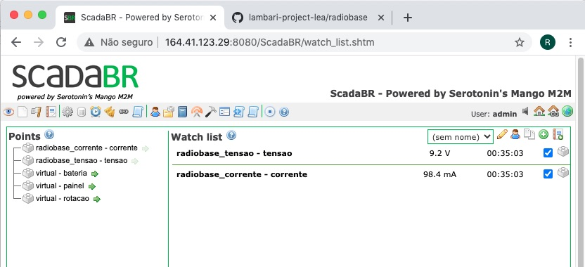

A primeira tela sinótica que mostra as variaveis

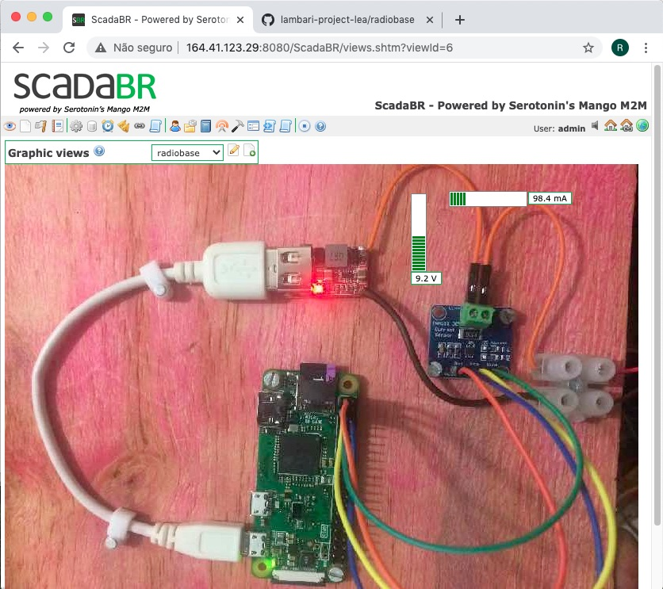

A entrada dos dados é pela tela de Data Sources.

Os dados são lidos pelo protocolo ASCII File Reader de ScadaBR.


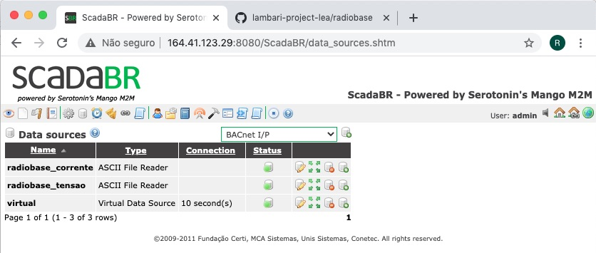

Os detalhes do data points.
 
Os arquivos de trabalho são lidos a cada 1 segundos, mas eles estão atualizados pelo cópia remotoa a cada 5 segundos pelo programa `inicia.sh`

Ainda tem um bug. O ScadaBR não consegue distinguir entre valores negativos e positivos. Tem que ajustar o REGEX (resolvido...!!).

| item | arquivo       | formato 
|:-:|-----------------:|:------------------------------|
| 1 | bat_tensao.log   |`2020-11-29 18:13:07 13.428`   |
| 2 | bat_corrente.log |`2020-11-29 18:13:54 -1479.073`|
| 3 | bat_potencia.log |`2020-11-29 18:15:59 19998.049`|
| 4 | tensao.log       |
| 5 | corrente.log     |
| 6 | potencia.log     |


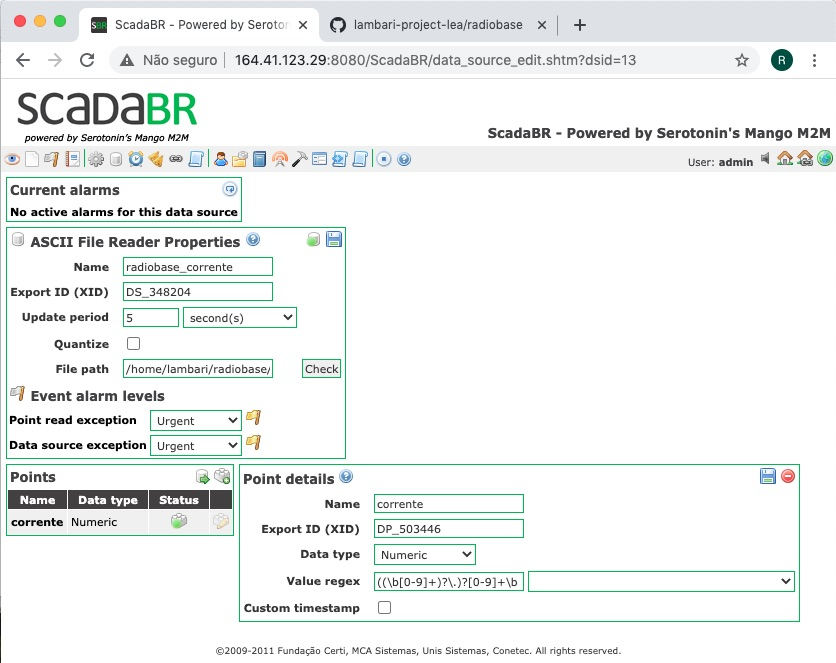